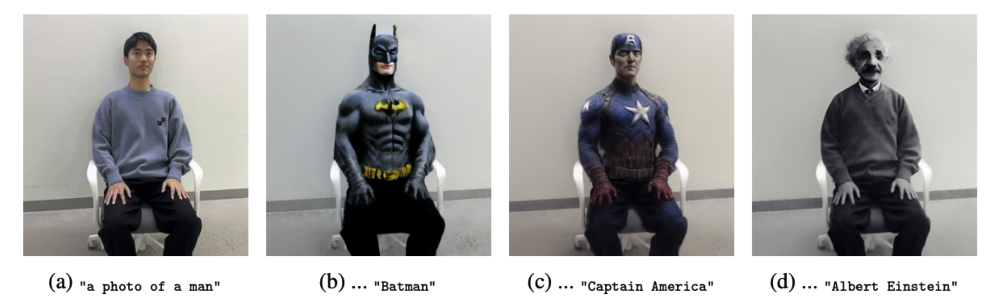
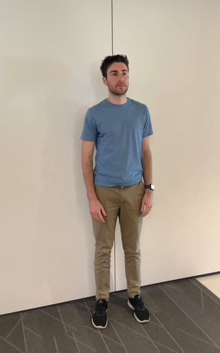
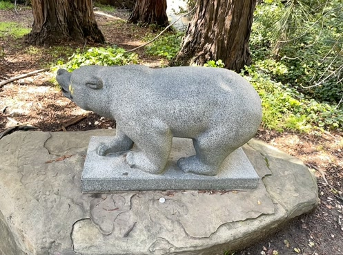
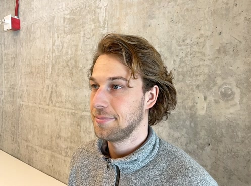

<h2 align="center">
    Enhancing Score Distillation Sampling for 3D editing
</h2>
<h5 align="center">
    Seonho Lee, Jiho Choi, Gwangyeon An<br>
    KAIST<br>
    20243597, 20245366, 20234243<br>
  <!-- <a href="https://arxiv.org/pdf/2203.11876.pdf">arXiv</a> |
  <a href="https://www.mmlab-ntu.com/project/ovdetr/index.html">Project Page</a> |
  <a href="https://github.com/yuhangzang/OV-DETR">Code</a> -->
</h5>

---

### Introduction

The field of 3D representation learning is evolving through the use of
Score Distillation Sampling (SDS) to utilize large-scale pre-trained 2D models,
addressing the scarcity of 3D data and enhancing modeling capabilities. Despite
advancements, existing 3D editing approaches such as Posterior Distillation Sam-
pling (PDS) often struggle with balancing identity preservation and editability, a
challenge partly due to the coefficient divergence at lower timesteps. We introduce
an effective formulation for 3D editing that leverages a pre-trained 2D model con-
ditioned on the source image, significantly enhancing identity preservation while
maintaining high fidelity in editing outputs. By incorporating a methodical decre-
mental adjustment of timesteps and integrating advanced editing frameworks, our
approach not only stabilizes the editing process but also substantially accelerates
it, establishing a novel approach for efficient and coherent 3D editing

<div align="center">
    
</div>

### Updates

- TBA


### Examples

<div align="center">
    
    
    <div>
    "a photo of a person" → "Turn him into a clown"
    </div>
</div>

<br/>
<div align="center">
    
    
    <div>
    "a photo of a bear" → "Turn him into a grizzily bear"
    </div>
</div>

<br/>
<div align="center">
    
    
    <div>
    "a photo of a face" → "Give him a cowboy hat"
    </div>
</div>

### Installation

<!-- TODO: INSTALL.md -->

```bash
# 1. Install dependencies
cd GDS
conda create -n gds python=3.9
conda activate gds
pip install torch==2.1.2+cu118 torchvision==0.16.2+cu118 --extra-index-url https://download.pytorch.org/whl/cu118
conda install -c "nvidia/label/cuda-11.8.0" cuda-toolkit
pip install ninja git+https://github.com/NVlabs/tiny-cuda-nn/#subdirectory=bindings/torch
pip install -e .

# 2. Install 3D Editing
cd PDS/3d_editing
pip install -e .
```

You should be able to see a `pds` option in the following command:

```bash
ns-train -h
```
<br/>

### Prepare Datasets

A subset of the 3D scene data is from [Instruct-NeRF2NeRF](https://1drv.ms/f/s!AtxL_EOxFeYMk3rftsoc4L8cg0VS?e=Hhbprk).


### RUN

#### 1. Initialize 3D Scenes

```bash
ns-train nerfacto --data {DATASET_PATH} --viewer.websocket-port {PORT_NUMBER} --pipeline.model.use_appearance_embedding False
```

Below is an example of intializing NeRF with the provided dataset.

```bash
ns-train nerfacto --data ../data/yuseung --viewer.websocket-port {PORT_NUMBER} --pipeline.model.use_appearance_embedding False
```


#### 2. 


```
Arguments:
  --data DATA           Path to the dataset directory.
  --load-dir LOAD_DIR   Path to the directory containing the pre-trained model.
  --pipeline.pds.src_prompt SRC_PROMPT
                        Source prompt for the model.
  --pipeline.pds.tgt_prompt TGT_PROMPT
                        Target prompt for the model.
  --pipeline.pds.sd_pretrained_model_or_path SD_PRETRAINED_MODEL_OR_PATH
                        Path to the pre-trained model. (e.g., timbrooks/instruct-pix2pix, runwayml/stable-diffusion-v1-5)
  --pipeline.pds.use_freeu USE_FREEU
                        Use FreeU for the model. 
  --pipeline.pds.use_pds USE_PDS
                        Use PDS for the model with instruct-pix2pix.
  --pipeline.only_pds ONLY_PDS
                        Use only PDS for the model with stable-diffusion-v1-5.
  --pipeline.pds.timestep_annealing TIMESTEP_ANNEALING
                        Use decreasing timestep scheduling for the model.
  --viewer.websocket-port WEBSOCKET_PORT
                        Port number for the websocket.
```

```bash
ns-train pds --data {DATASET_PATH} --load-dir {PATH/TO/OUTPUT_DIR/nerfstudio_models} --pipeline.pds.src_prompt {SRC_PROMPT} --pipeline.pds.tgt_prompt {TGT_PROMPT} --pipeline.pds.sd_pretrained_model_or_path {SD_PRETRAINED_MODEL_OR_PATH} --pipeline.pds.use_freeu {USE_FREEU} --pipeline.pds.use_pds {USE_PDS} --pipeline.pds.timestep_annealing {TIMESTEP_ANNEALING} --viewer.websocket-port {port_number}
```

Below is an example of running our proposed method with the provided dataset.


```bash
ns-train pds --data ../../data/yuseung/ --load-dir {PATH/TO/OUTPUT_DIR/nerfstudio_models} --pipeline.pds.src_prompt "a photo of a man" --pipeline.pds.tgt_prompt "a photo of a Batman" --pipeline.pds.sd_pretrained_model_or_path timbrooks/instruct-pix2pix --pipeline.pds.use_freeu True --pipeline.pds.use_pds False --pipeline.pds.timestep_annealing True --viewer.websocket-port {port_number}
```

If you want to use only PDS for the model with stable-diffusion-v1-5, you can use the following command.

```bash
ns-train pds --data ../../data/yuseung/ --load-dir {PATH/TO/OUTPUT_DIR/nerfstudio_models} --pipeline.pds.src_prompt "a photo of a man" --pipeline.pds.tgt_prompt "a photo of a Batman" --pipeline.pds.sd_pretrained_model_or_path runwayml/stable-diffusion-v1-5 --pipeline.only_pds True --viewer.websocket-port {port_number}
```


### Acknowledgement

[Posterior Diffusion Sampling](https://github.com/KAIST-Visual-AI-Group/PDS)

[Instruct-Pix2Pix]()